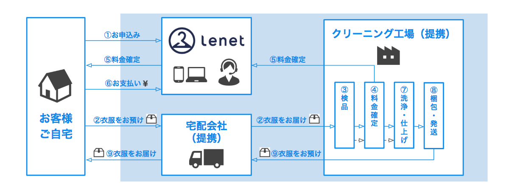

@snap[midpoint span-100 text-05]
# Composer APIを使った動的クラスローディング
@snapend

@snap[south-east span-100 text-07]
Dec 01, 2019
PHPカンファレンス2019 懇親会LT
永宮　悠大
@snapend

---

@snap[north-west]
## 自己紹介
@snapend

@snap[west span-55]
永宮　悠大（NAGAMIYA Yuta）
- 株式会社ホワイトプラスのエンジニア
- PHPの下回りを見てます
- @fa[github] [@ngmy](https://github.com/ngmy)
- クライミング8：エンジニアリング2
@snapend

@snap[east span-45]

@snapend

---

@snap[north span-100]
## ホワイトプラス
@snapend

@snap[midpoint span-90]

@snapend

@snap[south span-100]
https://www.wh-plus.co.jp/
@snapend

---

@snap[north span-100]
## リネット
@snapend

@snap[midpoint span-90]

@snapend

@snap[south span-100 text-05]
- 衣類クリーニング
    - https://www.lenet.jp/
- 衣類クリーニング + 保管
    - https://www.lenet-hokan.jp/
- 布団クリーニング
    - https://www.futonlenet.jp/
- 靴クリーニング
    - https://www.kutsulenet.jp/</dd>
@snapend

---

### composer.jsonを動的に読み込みたくなった

---

なんで？

---

@snap[north span-100]
特殊なLaravelの使い方をしているせい
@snapend

@snap[south-west span-50 text-08 text-red]
```text
リネット
├── 衣類
│   ├── ...
│   ├── composer.json
│   └── vendor
├── 保管
│   ├── ...
│   ├── composer.json
│   └── vendor
├── 布団
│   ├── ...
│   ├── composer.json
│   └── vendor
├── 靴
│   ├── ...
│   ├── composer.json
│   └── vendor
├── CMS
│   ├── ...
│   ├── composer.json
│   └── vendor
└── Laravel + 共有ライブラリ
    ├── ...
    ├── composer.json    
    └── vendor
```

@snap[east span-50 text-08]
```json
{
    "autoload": {
        "classmap": [
            ...
        ],
        "files": [
            ...
        ]
    }
}
```
@snapend

@[1]
@[1, 3]
@[2, 4]

---

@snap[south-west span-50 text-08 text-red]
```text
リネット
├── 衣類
│   ├── ...
│   ├── composer.json
│   └── vendor
├── 保管
│   ├── ...
│   ├── composer.json
│   └── vendor
├── 布団
│   ├── ...
│   ├── composer.json
│   └── vendor
├── 靴
│   ├── ...
│   ├── composer.json
│   └── vendor
├── CMS
│   ├── ...
│   ├── composer.json
│   └── vendor
└── Laravel + 共有ライブラリ
    ├── ...
    ├── composer.json    
    └── vendor
```

@snap[east span-50 text-08]
```json
{
    "autoload": {
        "classmap": [
            ...
        ],
        "files": [
            ...
        ]
    }
}
```
@snapend

---

@snap[south-west span-50 text-08 text-red]
```text
リネット
├── 衣類
│   ├── ...
│   ├── composer.json
│   └── vendor
├── 保管
│   ├── ...
│   ├── composer.json
│   └── vendor
├── 布団
│   ├── ...
│   ├── composer.json
│   └── vendor
├── 靴
│   ├── ...
│   ├── composer.json
│   └── vendor
├── CMS
│   ├── ...
│   ├── composer.json
│   └── vendor
└── Laravel + 共有ライブラリ
    ├── ...
    ├── composer.json    
    └── vendor
```

@snap[east span-50 text-08]
```json
{
    "autoload": {
        "classmap": [
            ...
        ],
        "files": [
            ...
        ]
    }
}
```
@snapend

---

@snap[south-west span-50 text-08 text-red]
```text
リネット
├── 衣類
│   ├── ...
│   ├── composer.json
│   └── vendor
├── 保管
│   ├── ...
│   ├── composer.json
│   └── vendor
├── 布団
│   ├── ...
│   ├── composer.json
│   └── vendor
├── 靴
│   ├── ...
│   ├── composer.json
│   └── vendor
├── CMS
│   ├── ...
│   ├── composer.json
│   └── vendor
└── Laravel + 共有ライブラリ
    ├── ...
    ├── composer.json    
    └── vendor
```

@snap[east span-50 text-08]
```json
{
    "autoload": {
        "classmap": [
            ...
        ],
        "files": [
            ...
        ]
    }
}
```
@snapend

---

@snap[south-west span-50 text-08 text-red]
```text
リネット
├── 衣類
│   ├── ...
│   ├── composer.json
│   └── vendor
├── 保管
│   ├── ...
│   ├── composer.json
│   └── vendor
├── 布団
│   ├── ...
│   ├── composer.json
│   └── vendor
├── 靴
│   ├── ...
│   ├── composer.json
│   └── vendor
├── CMS
│   ├── ...
│   ├── composer.json
│   └── vendor
└── Laravel + 共有ライブラリ
    ├── ...
    ├── composer.json    
    └── vendor
```

@snap[east span-50 text-08]
```json
{
    "autoload": {
        "classmap": [
            ...
        ],
        "files": [
            ...
        ]
    }
}
```
@snapend

---

@snap[south-west span-50 text-08 text-red]
```text
リネット
├── 衣類
│   ├── ...
│   ├── composer.json
│   └── vendor
├── 保管
│   ├── ...
│   ├── composer.json
│   └── vendor
├── 布団
│   ├── ...
│   ├── composer.json
│   └── vendor
├── 靴
│   ├── ...
│   ├── composer.json
│   └── vendor
├── CMS
│   ├── ...
│   ├── composer.json
│   └── vendor
└── Laravel + 共有ライブラリ
    ├── ...
    ├── composer.json    
    └── vendor
```

@snap[east span-50 text-08]
```json
{
    "autoload": {
        "classmap": [
            ...
        ],
        "files": [
            ...
        ]
    }
}
```
@snapend

---

@snap[south-west span-50 text-08 text-red]
```text
リネット
├── 衣類
│   ├── ...
│   ├── composer.json
│   └── vendor
├── 保管
│   ├── ...
│   ├── composer.json
│   └── vendor
├── 布団
│   ├── ...
│   ├── composer.json
│   └── vendor
├── 靴
│   ├── ...
│   ├── composer.json
│   └── vendor
├── CMS
│   ├── ...
│   ├── composer.json
│   └── vendor
└── Laravel + 共有ライブラリ
    ├── ...
    ├── composer.json    
    └── vendor
```

@snap[east span-50 text-08]
```json
{
    "name": "laravel/laravel",
    "description": "The Laravel Framework.",
    "keywords": ["framework", "laravel"],
    "license": "MIT",
    "type": "project",
    "repositories": [
        {
            "type": "vcs",
            "url": "git@github.com:WHITEPLUS/php-csv.git"
        },
        {
            "packagist": false
        },
        {
            "type": "composer",
            "url": "https://packagist.jp"
        },
        {
            "type": "vcs",
            "url": "git@github.com:WHITEPLUS/apns.git"
        },
        {
            "type": "vcs",
            "url": "git@github.com:WHITEPLUS/ks-connect-module-php7.git"
        }
    ],
    "require": {
        "php": ">=7.0.0",
        "aws/aws-sdk-php": "*",
        "aws/aws-sdk-php-laravel": "3.*",
        "doctrine/dbal": "^2.5",
        "fabpot/goutte": "~3.0",
        "fideloper/proxy": "~3.3",
        "google/apiclient": "1.0.*@beta",
        "guzzlehttp/guzzle": "~6.0",
        "guzzlehttp/streams": "~3.0",
        "hackzilla/barcode-bundle": "~1.0",
        "intervention/image": "2.*",
        "intervention/imagecache": "dev-master",
        "jenssegers/agent": "*",
        "jwage/php-apns": "*",
        "laravel/framework": "5.5.*",
        "laravel/tinker": "~1.0",
        "laravelcollective/html": "^5.3.0",
        "monolog/monolog": ">=1.9.1",
        "mustangostang/spyc": "*",
        "nategood/httpful": "*",
        "paygent/connect": "1.0",
        "picqer/php-barcode-generator": "*",
        "predis/predis": "^1.1",
        "sendgrid/sendgrid": "~2.1",
        "swiftmailer/swiftmailer": "~6.0",
        "symfony/dom-crawler": "3.1.*",
        "symfony/stopwatch": "3.2.*",
        "twilio/sdk": "dev-master",
        "whiteplus/apns": "1.2.0",
        "whiteplus/csv": "1.3.0",
        "ytake/laravel-smarty": "~2.0"
    },
    "require-dev": {
        "barryvdh/laravel-debugbar": "~2.4",
        "barryvdh/laravel-ide-helper": "*",
        "filp/whoops": "~2.0",
        "fzaninotto/faker": "~1.4",
        "laracasts/generators": "^1.1",
        "mockery/mockery": "~1.0",
        "pda/pheanstalk": "~3.0",
        "phpmd/phpmd": "*",
        "phpmetrics/phpmetrics": "^2.0",
        "phpstan/phpstan": "^0.10.5",
        "phpunit/dbunit": ">=1.2",
        "phpunit/php-invoker": "*",
        "phpunit/phpcov": "^4.0",
        "phpunit/phpunit": "~6.0",
        "phpunit/phpunit-selenium": "^4.0",
        "squizlabs/php_codesniffer": "3.*",
        "symfony/css-selector": "3.1.*",
        "symfony/thanks": "^1.0"
    },
    "autoload": {
        "classmap": [
            "app/Console/commands_l4",
            "database/seeds",
            "database/factories",
            "controllers",
            "lib/dbi",
            "lib/exception",
            "lib/factory",
            "lib/logic",
            "lib/model",
            "lib/orm",
            "lib/util"
        ],
        "psr-4": {
            "App\\": "app/",
            "Comnect\\": "lib/Comnect/",
            "Finance\\": "lib/Finance/",
            "Lenet\\": "lib/Lenet/",
            "Repository\\": "lib/Repository/"
        },
        "files": [
            "app/helpers.php"
        ]
    },
    "autoload-dev": {
        "classmap": [
            "tests/LenetTestCase.php",
            "tests/TestCase.php"
        ],
        "psr-4": {
            "Tests\\": "tests/"
        }
    },
    "extra": {
        "laravel": {
            "dont-discover": [
            ]
        }
    },
    "scripts": {
        "post-root-package-install": [
            "@php -r \"file_exists('.env') || copy('.env.example', '.env');\""
        ],
        "post-create-project-cmd": [
            "@php artisan key:generate --ansi"
        ],
        "post-autoload-dump": [
            "Illuminate\\Foundation\\ComposerScripts::postAutoloadDump",
            "@php artisan package:discover --ansi"
        ],
        "post-install-cmd": [
            "@link-paygent-php-config"
        ],
        "post-update-cmd": [
            "@link-paygent-php-config"
        ],
        "phpunit": [
            "@php vendor/bin/phpunit -c phpunit.xml"
        ],
        "phpstan": [
            "@php vendor/bin/phpstan analyse -c phpstan.neon"
        ],
        "phpcs": [
            "@php vendor/bin/phpcs --standard=phpcs-ruleset.xml"
        ],
        "phpmd": [
            "@php vendor/bin/phpmd app,controllers,lib text phpmd-ruleset.xml --suffixes php"
        ],
        "coverage-no-hokan": [
            "@php -r \"is_dir('build/coverage.cov') || mkdir('build/coverage.cov', 0777, true);\"",
            "phpdbg -qrr vendor/bin/phpunit -c phpunit.xml --exclude-group isolated,db,integration,hokan --log-junit build/phpunit.result.xml/phpunit.result.no-hokan.xml --coverage-php build/coverage.cov/coverage.no-hokan.cov"
        ],
        "coverage-hokan": [
            "@php -r \"is_dir('build/coverage.cov') || mkdir('build/coverage.cov', 0777, true);\"",
            "phpdbg -qrr vendor/bin/phpunit -c phpunit.xml --group hokan --exclude-group isolated,db,integration --log-junit build/phpunit.result.xml/phpunit.result.hokan.xml --coverage-php build/coverage.cov/coverage.hokan.cov"
        ],
        "coverage-db": [
            "@php -r \"is_dir('build/coverage.cov') || mkdir('build/coverage.cov', 0777, true);\"",
            "phpdbg -qrr vendor/bin/phpunit -c phpunit.xml --group db --exclude-group isolated,integration --log-junit build/phpunit.result.xml/phpunit.result.db.xml --coverage-php build/coverage.cov/coverage.db.cov"
        ],
        "coverage-integration": [
            "@php -r \"is_dir('build/coverage.cov') || mkdir('build/coverage.cov', 0777, true);\"",
            "phpdbg -qrr vendor/bin/phpunit -c phpunit.xml --group integration --exclude-group isolated --log-junit build/phpunit.result.xml/phpunit.result.integration.xml --coverage-php build/coverage.cov/coverage.integration.cov"
        ],
        "phpunit-isolated": [
            "@php vendor/bin/phpunit -c phpunit.xml --group isolated --log-junit build/phpunit.result.xml/phpunit.result.isolated.xml "
        ],
        "merge-phpunit-results": [
            "@php merge-phpunit-xml.php build/phpunit.result.xml/ build/phpunit.result.xml/phpunit.result.xml"
        ],
        "merge-coverages": [
            "@php -dzend_extension=/usr/local/lib/php/extensions/no-debug-non-zts-20170718/xdebug.so vendor/bin/phpcov merge --html build/coverage.html --xml build/coverage.xml build/coverage.cov/"
        ],
        "link-paygent-php-config": [
            "@php -r \"is_link('vendor/paygent/connect/src/paygent_module/modenv_properties.php') || symlink('/etc/paygent-php/modenv_properties.php', 'vendor/paygent/connect/src/paygent_module/modenv_properties.php');\""
        ]
    },
    "config": {
        "sort-packages": true,
        "process-timeout": 0
    }
}
```
@snapend

---

### Composer API

https://getcomposer.org/apidoc/master/index.html

---

<iframe class="stretch" src="https://getcomposer.org/apidoc/master/index.html"></iframe>

---

```php
$loader = require base_path() . '/vendor/autoload.php';
$serviceLoader = require realpath($_SERVER['DOCUMENT_ROOT']) . '/../vendor/autoload.php';
$loader->addClassMap($serviceLoader->getClassMap()); // クラスマップ
foreach ($serviceLoader->getPrefixesPsr4() as $prefix => $paths) { // PSR-4
    $loader->addPsr4($prefix, $paths);
}
```

@[1]
@[2]
@[3]
@[4-6]

---

lenet.jpドメインにアクセスした時は共有ライブラリとlenet.jpのコードだけが見える。
他サービスのコードが見えない

---

Composer APIを使えば単純にcomposer.jsonを読み込む以外にも色々できる
（ご利用は計画的に）

---

ご静聴ありがとうございました
