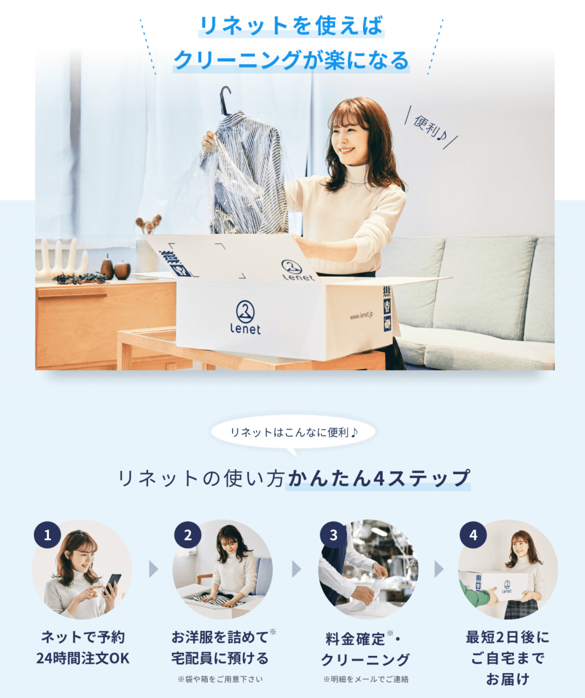

@snap[midpoint span-100 text-07]
# Laravelでモジュラモノリス
@snapend

@snap[south-east span-100 text-07]
2019年12月1日（日）
PHPカンファレンス2019 懇親会LT
永宮　悠大
@snapend

---

@snap[north-west]
## 自己紹介
@snapend

@snap[west span-100 text-08]
- 永宮　悠大（NAGAMIYA Yuta）
- 株式会社ホワイトプラスのエンジニア
- PHP、Laravelの面倒を見てます
- @fa[github] [@ngmy](https://github.com/ngmy)
- クライミング8：エンジニアリング2
@snapend

@snap[east span-40]

@snapend

---

@snap[north span-100 text-07]
## ホワイトプラスを知ってる人？ &#x1f64b;
@snapend

@snap[midpoint span-90]

@snapend

@snap[south span-100]
https://www.wh-plus.co.jp/
@snapend

---

@snap[north span-100 text-07]
## ゴールドスポンサーやってます
@snapend

@snap[south span-90]

@snapend

---

@snap[north span-100 text-07]
## リネットやってます
@snapend

@snap[west span-40]

@snapend

@snap[east span-50 text-07]
- 宅配クリーニングのリネット
- PC・スマホから注文できて、自宅にいたままクリーニングできるWebサービス
- 衣類クリーニング
    - https://www.lenet.jp/
- 衣類クリーニング + 保管
    - https://www.lenet-hokan.jp/
- 布団クリーニング
    - https://www.futonlenet.jp/
- 靴クリーニング
    - https://www.kutsulenet.jp/</dd>
- PHP + Laravelで構築
@snapend

---?image=assets/img/toy_dorodango_kirei.png&size=auto 80%

@snap[north span-100 text-07]
## モノリス
@snapend

---?image=assets/img/rubiks_cube.png&size=auto 80%

@snap[north span-100 text-07]
## モジュラモノリス
@snapend

---

モノリスから複数のマイクロサービスを抽出するより、まずアプリ内をモジュラーにしていく
独立したサービスとして抽出する前にアーキテクチャ上のよい境界を見つける。スムーズに移行しやすいようにコードを構成しておく

---

### モジュールに分割する

---

@snap[north span-100]
リネットリポジトリのディレクトリ構成
@snapend

@snap[west span-40]
```text
lenet
├── lenet_common
├── lenet.jp
├── lenet-hokan.jp
├── futonlenet.jp
├── kutsulenet.jp
└── wh-plus.com
```
@snapend

@snap[east span-60 text-center]
@[1-7](1つの共有コード + 5つのサービス)
@[2](共有コード（Laravel + 共有ライブラリ）)
@[3](サービス1（衣類）)
@[4](サービス2（保管）)
@[5](サービス3（布団）)
@[6](サービス4（靴）)
@[7](サービス5（社内・工場CMS）)
@snapend

---

@snap[north span-100]
共有コードのディレクトリ構成
@snapend

@snap[west span-40]
```text
lenet_common
├── app
├── bootstrap
├── config
├── database
├── lib
├── public
├── resources
├── routes
├── storage
├── tests
├── vendor
├── composer.json
└── phpstan.neon
```
@snapend

@snap[east span-60 text-center]
@[2-5, 7-13](Laravel)
@[6](共有ライブラリ)
@[14](PHPStanの設定ファイル)
@snapend

---

@snap[north span-100]
各サービスのディレクトリ構成
@snapend

@snap[west span-40]
```text
lenet.jp
├── app
├── config
├── controllers
├── lib
├── public
├── templates
├── vendor
├── composer.json
└── phpstan.neon
```
@snapend

@snap[east span-60 text-center]
@[2](ルートファイル、ミドルウェア、例外ハンドラ等)
@[3](サービス固有の設定)
@[4](コントローラ)
@[5](ライブラリ)
@[6](ドキュメントルート)
@[7](テンプレート)
@[8-9](composer.json + vendor)
@[10](PHPStanの設定ファイル)
@snapend

---

@snap[north span-100]
各サービスのindex.php → Laravelのindex.php
@snapend

```php
require $_SERVER['DOCUMENT_ROOT'] . '/../../lenet_common/public/index.php';
```

---

@snap[north span-100]
Laravelのルートファイル → 各サービスのルートファイル
@snapend

```php
require SERVICE_BASEDIR . '/app/routes.php';
```

---

### 境界を遵守させる

---

Composer APIでオートロードするクラスを制限する

---

```php
$loader = require base_path() . '/vendor/autoload.php';
$serviceLoader = require realpath($_SERVER['DOCUMENT_ROOT'])
    . '/../vendor/autoload.php';
$loader->addClassMap($serviceLoader->getClassMap());
foreach ($serviceLoader->getPrefixesPsr4() as $prefix => $paths) {
    $loader->addPsr4($prefix, $paths);
}
```

@snap[south span-100]
@[1](Laravel + 共有ライブラリのautoload.phpを読み込む)
@[2-3](ドキュメントルートから応じたサービスのautoload.phpを読み込む)
@[4](Classmapをマージ)
@[5-7](PSR-4をマージ)
@snapend

---

PHPStanで依存の違反を検出する

---

@snap[north span-100 text-07]
## 各サービスのphpstan.neon
@snapend

```yaml
parameters:
  paths:
    - %rootDir%/../../../../kuritaku.jp/app
    - %rootDir%/../../../../kuritaku.jp/controllers
    - %rootDir%/../../../../kuritaku.jp/lib
  autoload_files:
    - %rootDir%/../../../vendor/autoload.php # 共有ライブラリ + Laravel
    - %rootDir%/../../../_ide_helper.php
    - %rootDir%/../../../../kuritaku.jp/vendor/autoload.php
```

---

@snap[north span-100 text-07]
## lenet_commonのphpstan.neon
@snapend

```yaml
parameters:
  paths:
    - %rootDir%/../../../app
    - %rootDir%/../../../controllers
    - %rootDir%/../../../lib
  autoload_files:
    - %rootDir%/../../../vendor/autoload.php
    - %rootDir%/../../../_ide_helper.php
```

---

ミドルウェアの登録

lenet_common/app/Providers/RouteServiceProvider.php

@snap[span-100 text-07]
```php
if ($_SERVER['HOST_SUFFIX'] == 'lenet.jp') {
    $this->app->make(Kernel::class)
        ->pushMiddleware(\Jp\Lenet\App\Http\Middleware\BeforeMiddleware::class);
    $this->app['router']
        ->aliasMiddleware('auth', \Jp\Lenet\App\Http\Middleware\Authenticate::class);
}
```
@snapend

---

設定ファイル

---

@snap[south-west span-50 text-07]
```text
lenet
├── lenet_common
│   ├── config
│   ├── public
│   │   └── index.php
│   ├── composer.json
│   ├── phpstan.neon
│   └── vendor
├── lenet.jp
│   ├── config
│   ├── public
│   │   └── index.php
│   ├── composer.json
│   ├── phpstan.neon
│   └── vendor
├── lenet-hokan.jp
│   ├── public
│   │   └── index.php
│   ├── composer.json
│   ├── phpstan.neon
│   └── vendor
├── futonlenet.jp
│   ├── public
│   │   └── index.php
│   ├── composer.json
│   ├── phpstan.neon
│   └── vendor
├── kutsulenet.jp
│   ├── public
│   │   └── index.php
│   ├── composer.json
│   ├── phpstan.neon
│   └── vendor
└── wh-plus.com
    ├── public
    │   └── index.php
    ├── composer.json
    ├── phpstan.neon
    └── vendor
```
@snapend

---

各サービスの設定ファイルはヘルパークラスを作って読み混んでる

---

Laravelの設定はすべて環境変数で流し込むようにしている
k8sのyaml

```
          env:
            - name: APP_ENV
              value: production
            - name: APP_HOST_PREFIX
              value: www
            - name: APP_SERVICE
              value: lenet.jp
            - name: APP_DB_ENDPOINT
              ...
```

---

ビューパス

```
<?php

    'paths' => [
        realpath(base_path('resources/views')),
        realpath(base_path('../lenet_common/app/views')), // TODO 移行完了したら削除する
        $_SERVER['DOCUMENT_ROOT'].'/../templates',
    ],

```

---

マイグレーション・バッチ・ストレージ

共通
Laravelのデフォルトそのまま
ただバッチはこの前DigDagに移行した

@snap[south span-40]

@snapend

---

必要なパスの書き換え

```
 $app->bind('path.public', function () {                                                                                 
     return $_SERVER['DOCUMENT_ROOT'];                                                                                   
 });   
```

---

エラーハンドリング


```
    public function report(Exception $exception)
    {
        ...

        // サービス固有のレポート処理
        $this->reportForService($exception);

        parent::report($exception);
    }

    public function render($request, Exception $exception)
    {
        ...

        // サービス固有のレンダー処理
        $response = $this->renderForService($request, $exception);
        if (!is_null($response)) {
            return $response;
        }

        return parent::render($request, $exception);
    }
```

---

```
<?php

class Handler extends BaseExceptionHandler
{
    /**
     * 例外をレポート、もしくはログする
     *
     * ここは例外をSentryやBugsnagなどへ送るために適した場所
     *
     * @param  \Exception  $exception
     * @return void
     */
    protected function reportForService(Exception $exception)
    {
    }

    /**
     * HTTPレスポンスへ例外をレンダー
     *
     * @param  \Illuminate\Http\Request $request
     * @param  \Exception               $exception
     * @return \Illuminate\Http\Response|null
     */
    public function renderForService($request, Exception $exception)
    {
        if (ErrorResponseUtil::is404($exception) || ErrorResponseUtil::is405($exception)) {
            if (starts_with($request->path(), ['plan', 'sp/plan'])) {
                return Redirect::to('/plan');
            }

            // Error 404
            return Response::stream(function () {
                if (Agent::isMobile()) {
                    include public_path('sp/errordoc/404.php');
                } else {
                    include public_path('errordoc/404.php');
                }
            }, 404);
        }

        // 開発環境のシステムエラーはトレース表示させたいのでレスポンスを作らない
        if (!Config::get('app.debug')) {
            // Error Unknown
            return Response::view('error.' . TemplateUtil::baseDir() . '.index', [], 500);
        }
    }
}
```

---

サービスごとを疎結合にしつつ
共通のコードは共有できる

ゆくゆくはマイクロサービスかも目指す？

---

ご静聴ありがとうございました

---

### 一つのプロジェクトで複数のcomposer.jsonを読み込みたくなった

---

なんで？

---

リネットのLaravelのディレクトリ構成のクセがすごい

---

@snap[north span-100]
リネットのLaravelのディレクトリ構成
@snapend

@snap[south-west span-50 text-07]
```text
lenet
├── lenet_common
│   ├── public
│   │   └── index.php
│   ├── composer.json
│   └── vendor
├── lenet.jp
│   ├── public
│   │   └── index.php
│   ├── composer.json
│   └── vendor
├── lenet-hokan.jp
│   ├── public
│   │   └── index.php
│   ├── composer.json
│   └── vendor
├── futonlenet.jp
│   ├── public
│   │   └── index.php
│   ├── composer.json
│   └── vendor
├── kutsulenet.jp
│   ├── public
│   │   └── index.php
│   ├── composer.json
│   └── vendor
└── wh-plus.com
    ├── public
    │   └── index.php
    ├── composer.json
    └── vendor
```
@snapend

@snap[east span-50]
@[2](Laravelと共有ライブラリ)
@[2, 3-4](Laravelのindex.php)
@[2, 5-6](Laravelのcomposer.jsonとvendor<br>共有ライブラリをpsr-4に登録している)
@[7](衣類のコード)
@[7, 8-9](衣類のドキュメントルート<br>Laravelのindex.phpをrequireしている)
@[7, 10-11](衣類のcomposer.jsonとvendor<br>名前空間なしのレガシーなコードをclassmapに登録している)
@[12-16](保管のコード<br>※衣類と同じ)
@[17-21](布団のコード<br>※衣類と同じ)
@[22-26](靴のコード<br>※衣類と同じ)
@[27-31](社内・工場CMSのコード<br>※衣類と同じ)
@snapend

---

### Composer API

https://getcomposer.org/apidoc/master/index.html

---

<iframe class="stretch" src="https://getcomposer.org/apidoc/master/index.html"></iframe>

---

```php
$loader = require base_path() . '/vendor/autoload.php';
$serviceLoader = require realpath($_SERVER['DOCUMENT_ROOT'])
    . '/../vendor/autoload.php';
$loader->addClassMap($serviceLoader->getClassMap());
foreach ($serviceLoader->getPrefixesPsr4() as $prefix => $paths) {
    $loader->addPsr4($prefix, $paths);
}
```

@snap[south span-100]
@[1](Laravel + 共有ライブラリのautoload.phpを読み込む)
@[2-3](ドキュメントルートから応じたサービスのautoload.phpを読み込む)
@[4](Classmapをマージ)
@[5-7](PSR-4をマージ)
@snapend

---

@snap[midpoint span-100]

@snapend

+++

@snap[midpoint span-100]

@snapend

@snap[south span-100]
https://www.lenet.jp/ にアクセスした時
@snapend

+++

@snap[midpoint span-100]

@snapend

@snap[south span-100]
https://www.lenet-hokan.jp/ にアクセスした時
@snapend

+++

@snap[midpoint span-100]

@snapend

@snap[south span-100]
https://www.futonlenet.jp/ にアクセスした時
@snapend

+++

@snap[midpoint span-100]

@snapend


@snap[south span-100]
https://www.kutsulenet.jp/ にアクセスした時
@snapend

+++

@snap[midpoint span-100]

@snapend

@snap[south span-100]
社内・工場CMSにアクセスした時
@snapend

---

Composer APIを使えば単純にcomposer.jsonを読み込む以外にも色々できる
（ご利用は計画的に）

---

ご静聴ありがとうございました
